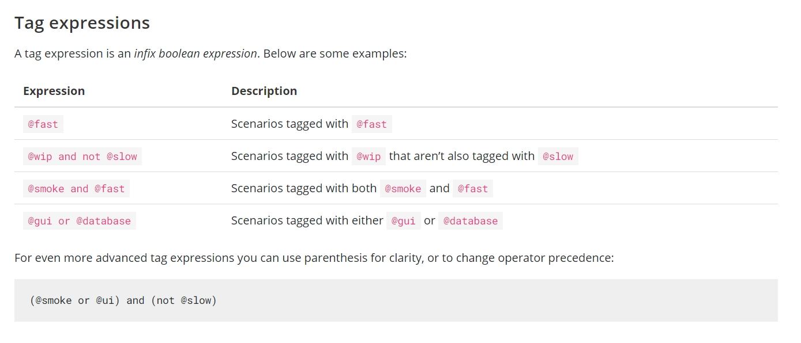

# Cucumber Data Tables POC

---

* To Run Cucumber Tags form maven command line use below command
* ```mvn test -Dcucumber.filter.tags="@addtocart"```
* The added tag in above command will override the tag in your TestRunner class

---
* Below are few configurations for cucumber tagging
>

---
